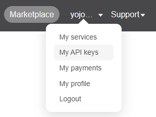

# balena-desktop-weather
Balena-fied version of the mustard corner desktop weather device

You can [buy a kit here](https://mustardcorner.com/desktop-weather) or [build one yourself!](https://mustardcorner.com/desktop-weather)

## Setup

- OpenWeather API key
    1. Create an account [here](https://home.openweathermap.org/users/sign_up)
    2. Go to “My API keys” from the top right menu:
        
    3. Generate a new API key using any name you like.
    4. Ensure that the API key is activated and the status says “Active”.
    5. Copy the Key as we will need this later. You will set the environment variable of `OPEN_WEATHER_APIKEY` with this key.
        Note: It takes about 10-15 minutes for the API key to start working and for us to have access.

## Environment variables

| Environment variable | Type | Default | Description |
| --- | --- | --- | --- |
|`OPEN_WEATHER_APIKEY`|`String`|`not_set`|OpenWeather API key|
|`LATITUDE`|`Number`|`19.6069`|Set your latitude|
|`LONGITUDE`|`Number`|`-155.5056`|Set your longitude|
|`SERVO_PIN_1`|`Number`|`18`|Opional pin for first servo|
|`SERVO_PIN_2`|`Number`|`23`|Opional pin for second servo|
|`BUTTON_PIN`|`Number`|`17`|Optional pin for your push button|
---
